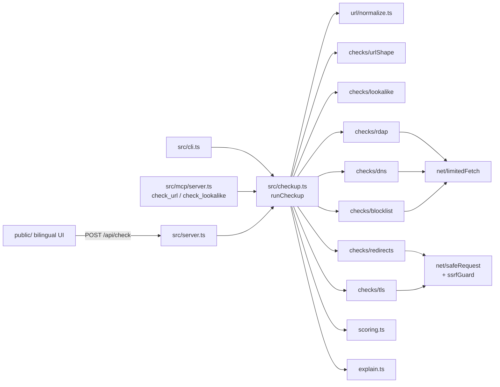
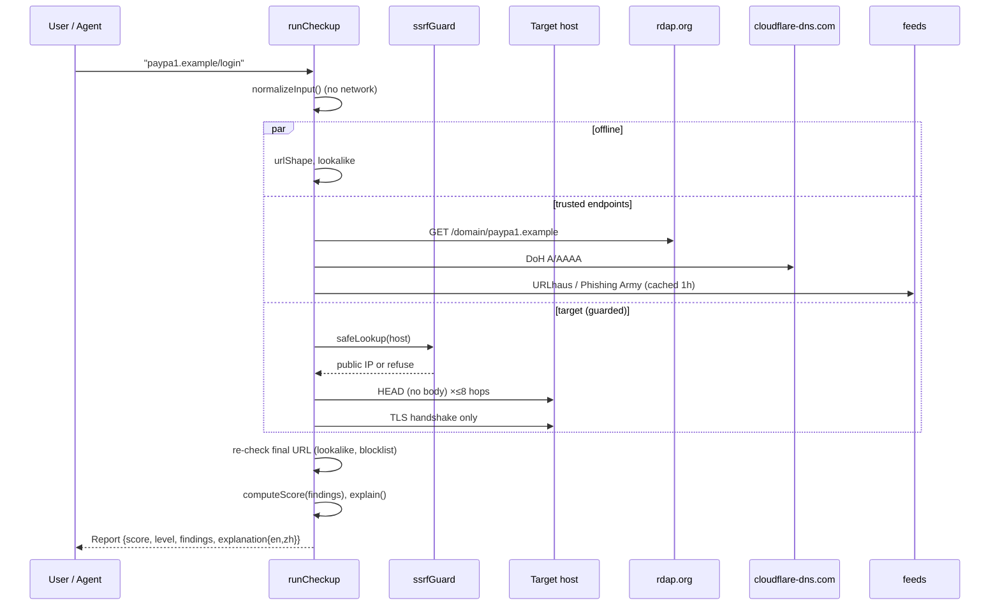

# Design Document

## Overview

Link Checkup is a single Node.js (TypeScript, ESM) package with three thin front doors — a web server,
a CLI and an MCP stdio server — over one engine, `runCheckup(input, options)`. The engine normalises the
input, runs six independent checks in parallel under a global time budget, re-runs the "identity" checks
(lookalike, blocklist) on the final redirect target if it changed domain, then scores the findings with a
pure function and renders a bilingual one-sentence verdict.

The overriding design constraint is **"never open the page"** (Requirement 2) and its operational twin
**"never become an SSRF proxy"** (Requirement 3). Both are enforced in exactly one module
(`src/net/`), which every check that touches a Target must use.

## Architecture



### Sequence of one checkup



## Components and Interfaces

| Module | Responsibility | Key exports |
|---|---|---|
| `url/normalize.ts` | Validate + normalise input (Req 1) | `normalizeInput(raw): NormalizeResult` |
| `net/ssrfGuard.ts` | Address policy (Req 3) | `isBlockedAddress(ip)`, `safeLookup`, `assertPublicHost(host)` |
| `net/safeRequest.ts` | HEAD / zero-byte GET, TLS handshake (Req 2) | `headOnlyRequest(url, opts)`, `tlsHandshake(host, opts)` |
| `net/limitedFetch.ts` | Timeout + byte cap for trusted endpoints | `fetchLimited(url, opts)` |
| `checks/urlShape.ts` | Structural signals | `urlShapeCheck(ctx)` |
| `checks/lookalike.ts` | Req 8, offline | `analyzeLookalike(host)`, `lookalikeCheck(ctx)`, `damerauLevenshtein(a,b)` |
| `checks/rdap.ts` | Req 5 | `rdapCheck(ctx)`, `parseRdap(json, now)` |
| `checks/dns.ts` | Req 6 | `dnsCheck(ctx)` |
| `checks/redirects.ts` | Req 4 | `followRedirects(url, transport, opts)`, `redirectsCheck(ctx)` |
| `checks/tls.ts` | Req 7 | `tlsCheck(ctx)`, `assessCertificate(info, now)` |
| `checks/blocklist.ts` | Req 9 | `blocklistCheck(ctx)`, `matchBlocklists(url, lists)` |
| `scoring.ts` | Req 10.1–10.4, pure | `computeScore(findings)`, `levelFor(score)` |
| `explain.ts` | Req 10.5 | `explain(report): Bilingual` |
| `checkup.ts` | Orchestration, budget | `runCheckup(input, options): Promise<Report>` |

Checks receive a `CheckContext` (`{ url, host, asciiHost, registrableDomain, now, offline, deps }`), where
`deps` holds injectable network functions so unit tests never touch the network.

## Data Models

```ts
type Severity = "info" | "low" | "medium" | "high" | "critical";
type Bilingual = { en: string; zh: string };
type CheckId = "urlShape" | "lookalike" | "rdap" | "dns" | "redirects" | "tls" | "blocklist";

interface Finding { id: string; check: CheckId; severity: Severity; points: number; title: Bilingual; detail: Bilingual }
interface CheckResult { check: CheckId; status: "ok" | "warn" | "error" | "skipped"; findings: Finding[]; data?: unknown; durationMs: number }
interface Report {
  input: string; normalizedUrl: string; displayHost: string; finalUrl: string;
  score: number; level: "low" | "medium" | "high";
  explanation: Bilingual; checks: CheckResult[]; findings: Finding[];
  checkedAt: string; durationMs: number; version: string;
}
```

## Correctness Properties

*A property is a characteristic or behavior that should hold true across all valid executions of a system —
essentially a formal statement about what the system should do. Properties serve as the bridge between
human-readable specifications and machine-verifiable correctness guarantees.*

### Property 1: Score is bounded
*For any* list of findings with non-negative points, `computeScore` returns an integer in [0, 100].
**Validates: Requirements 10.1**

### Property 2: Score is monotonic
*For any* list of findings F and any finding f, `computeScore(F ∪ {f}) ≥ computeScore(F)`.
**Validates: Requirements 10.4**

### Property 3: Critical findings dominate
*For any* list of findings containing at least one `critical` finding, `computeScore` ≥ 90 and `levelFor` = `high`.
**Validates: Requirements 10.2, 10.3**

### Property 4: Level partition
*For any* integer score in [0, 100], `levelFor` returns exactly one level and respects the 25 / 60 thresholds.
**Validates: Requirements 10.3**

### Property 5: No false positives on official domains
*For any* brand domain D in the Brand list and any sequence of valid subdomain labels P, `analyzeLookalike(P + "." + D)` returns no findings.
**Validates: Requirements 8.1**

### Property 6: Homoglyph substitution is detected
*For any* brand label of length ≥ 5 and any single substitution of one of its characters by a confusable from the homoglyph table, the resulting domain (on any TLD) yields a finding referencing that brand.
**Validates: Requirements 8.2**

### Property 7: Edit-distance metric sanity
*For any* strings a, b: `damerauLevenshtein(a, a) = 0`, `damerauLevenshtein(a, b) = damerauLevenshtein(b, a)`, and a single adjacent transposition yields distance ≤ 1.
**Validates: Requirements 8.3**

### Property 8: Private addresses are always blocked
*For any* IPv4 address in 10/8, 172.16/12, 192.168/16, 127/8, 169.254/16, 100.64/10, 0/8, 224/4 or 240/4 — and for its IPv4-mapped IPv6 form — `isBlockedAddress` returns true; *for any* IPv6 in fc00::/7, fe80::/10 or ::1 it returns true.
**Validates: Requirements 3.1, 3.2**

### Property 9: Normalisation is idempotent
*For any* input accepted by `normalizeInput`, normalising its `href` again yields the same `href`.
**Validates: Requirements 1.5**

### Property 10: Redirect following terminates
*For any* simulated transport (arbitrary graph of 3xx responses, including loops), `followRedirects` performs at most 8 + 1 requests and returns.
**Validates: Requirements 4.1, 4.3**

## Error Handling

- Each check is wrapped by `safeCheck()` in the orchestrator: exceptions become `status: "error"`,
  a bilingual `info` finding with **0 points**, and the checkup continues (unknown ≠ dangerous).
- A global `AbortController` enforces the 20 s budget; checks still running are reported as `skipped`.
- Input errors return HTTP 400 with `{ error: { en, zh } }`; rate limiting returns 429.
- Blocklist feeds that fail to download fall back to the last cached copy on disk if it is < 24 h old.

## Testing Strategy

- **Unit tests (vitest):** normaliser edge cases, each check's pure parser (`parseRdap`, `assessCertificate`,
  `matchBlocklists`), lookalike examples (`paypa1`, Cyrillic `аpple`, `paypal.com.verify.example`,
  `secure-paypal-login`), SSRF guard examples, redirect chains through a fake transport, explanation wording,
  and an end-to-end `runCheckup(..., { offline: true })`.
- **Property-based tests (fast-check):** Properties 1–10 above, ≥ 200 runs each, in `test/*.property.test.ts`,
  each tagged with the property number and the requirement it validates.
- **Live smoke test (manual, opt-in):** `npm run check -- https://example.com` against benign domains only.
  Real malicious URLs are never used in tests or demos.
