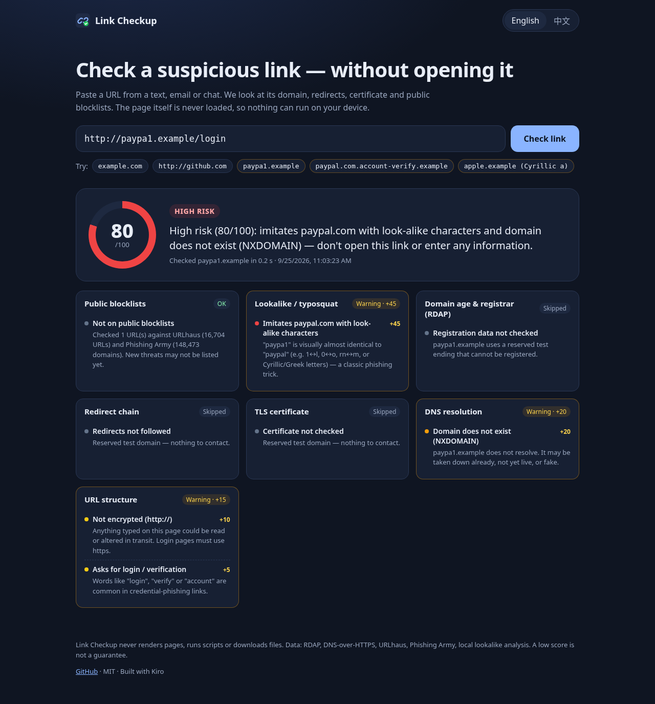
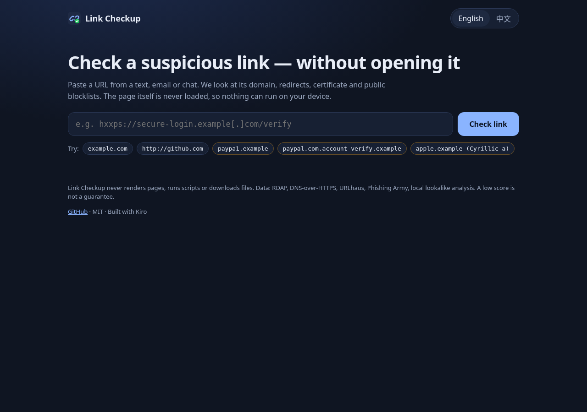
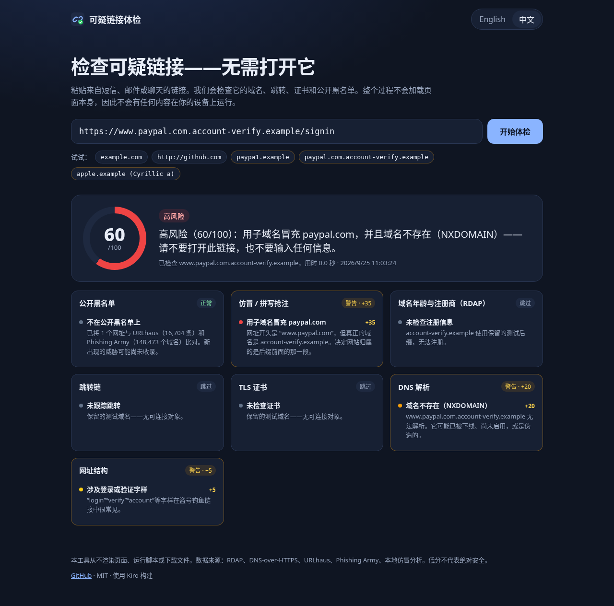
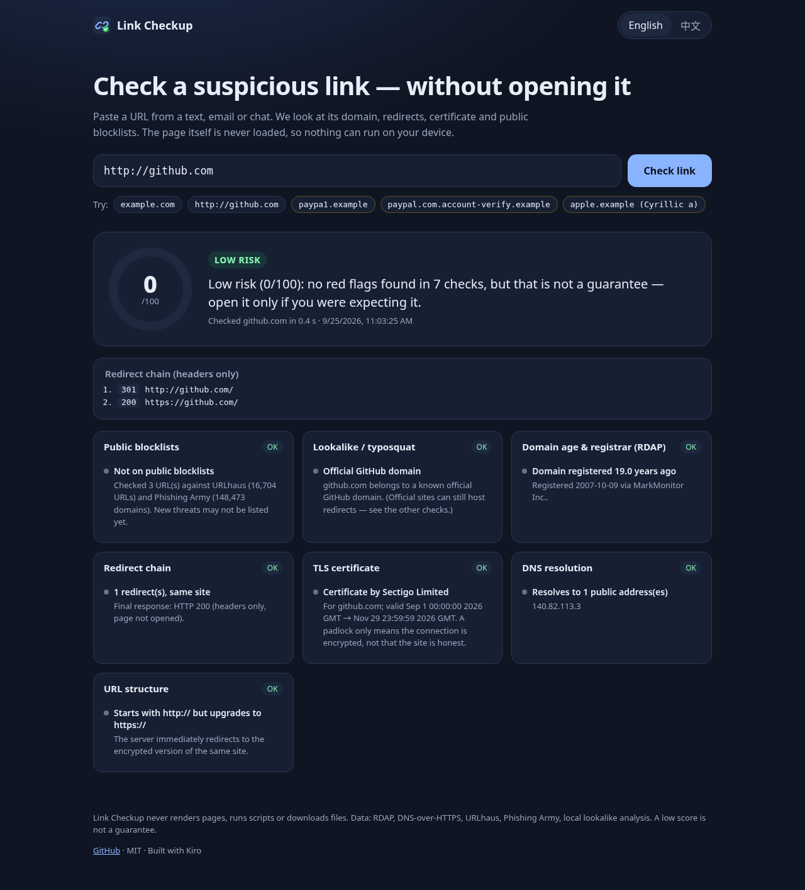

# Link Checkup · 可疑链接体检

**Check a suspicious link — without opening it.** Paste a URL from a text, email, chat or QR code and get a
0–100 risk score, per-check findings and a one-sentence verdict in English and 简体中文. The page is never
rendered, no JavaScript runs and nothing is downloaded.

Built for the **Kiro University Challenge 2026** final exam. Uses only free, keyless data sources.



## The problem

I get links I don't trust all the time — "your parcel is on hold", "verify your account", a friend's hacked
account sending "is this you in the video?". My habit is to forward them to an assistant to **screen them before
anyone clicks**, so my phone, laptop and accounts are never exposed. Opening a link "just to see" is exactly
what the attacker wants: it can fingerprint the device, trigger a download, or show a pixel-perfect fake login.

Link Checkup turns that screening into a repeatable tool. It answers *who really owns this link, how old is it,
where does it really go, and is it already known to be bad* — using only DNS, a TLS handshake and HTTP
**headers**. It works as a web page, a CLI, an **MCP server**, and a **Kiro custom agent** (`link-triage`) that
screens links on my behalf.

## What it checks

| Check | How (free, no API key) | Example signals |
|---|---|---|
| Public blocklists | [URLhaus](https://urlhaus.abuse.ch/) online-URL text feed + [Phishing Army](https://phishing.army/) domain list, cached 1 h, string-matched only | listed URL / domain → critical (score ≥ 90) |
| Lookalike / typosquat | Local: confusable-character skeletons, Damerau–Levenshtein, combosquat, brand-in-subdomain, mixed scripts / punycode vs. 49 brands | `paypa1`, Cyrillic `аpple`, `paypal.com.account-verify.example` |
| Domain age & registrar | [RDAP](https://rdap.org/) (`rdap.org` bootstrap) | registered < 30 days, registry hold |
| Redirect chain | `HEAD` (or zero-byte ranged `GET`), ≤ 8 hops, 6 s timeouts, **SSRF-guarded** | cross-site hops, https→http, `javascript:` targets, loops |
| TLS certificate | Bare TLS handshake (SNI), no HTTP request | invalid / expired / mismatched cert, issued < 7 days |
| DNS | DNS-over-HTTPS (Cloudflare → Google fallback) | NXDOMAIN, resolves to private IPs |
| URL structure | Local parsing | raw IP, `user@host` trick, odd port, deep subdomains, abused TLDs |

**Safety design** (see [`network-safety.md`](.kiro/steering/network-safety.md)):
every connection to a user-supplied host goes through [`src/net/safeRequest.ts`](src/net/safeRequest.ts):
all resolved IPs must be public unicast (loopback, RFC1918, link-local, CGNAT, ULA, IPv4-mapped/NAT64/6to4
forms are refused), the vetted IP is pinned to defeat DNS rebinding, only ports 80/443 are contacted,
response bodies are never read. Unknown results (timeouts, errors) add **0 points** — unknown ≠ dangerous.

**Scoring** ([`src/scoring.ts`](src/scoring.ts)): sum of finding points clamped to 0–100; any critical finding
forces ≥ 90; levels: low < 25 ≤ medium < 60 ≤ high. These invariants are enforced by property-based tests.

## Run it

Requires Node.js ≥ 20.

```bash
git clone https://github.com/kosermuy-maker/link-checkup && cd link-checkup
npm install
npm start                      # → http://127.0.0.1:8787  (English / 中文 toggle)
```

CLI and MCP:

```bash
npm run check -- "hxxp://paypa1[.]example/login"         # defanged input is fine
npm run check -- https://example.com --lang zh
npm run check -- https://example.com --json
npm run check -- paypa1.example --offline                # local checks only, no network
npm run mcp                                              # stdio MCP server (check_url, check_lookalike)
npm run mcp:smoke                                        # spawns the MCP server and calls both tools
npm test && npm run typecheck                            # 77 unit + property-based tests
```

API: `POST /api/check` with `{"url": "..."}` → JSON report (8 KB body limit, 30 checks/min per client).

> **Demo safely.** Use benign domains (`example.com`, `github.com`) and synthetic lookalikes on reserved TLDs
> (`paypa1.example`, `secure-paypal-login.test`). Never paste real phishing links into demos or tests.

Deploying is optional (it's a plain Node server; any free Node host works). It is designed to run locally.

> Hooks not firing or MCP panel empty in Kiro? See [docs/kiro-troubleshooting.md](docs/kiro-troubleshooting.md): trust the workspace, then **Reload Window**.

## How each Kiro lesson is used

| # | Lesson | Where | How it is used |
|---|---|---|---|
| 1 | **Spec-driven development** | [`.kiro/specs/link-checkup/requirements.md`](.kiro/specs/link-checkup/requirements.md), [`design.md`](.kiro/specs/link-checkup/design.md), [`tasks.md`](.kiro/specs/link-checkup/tasks.md) | 11 requirements with EARS acceptance criteria (e.g. *"WHEN a Target hostname resolves to any address that is not a Public address THE System SHALL refuse to connect"*), a design with architecture + sequence diagrams, and a task plan whose items reference requirement numbers. Git history follows the task list. |
| 2 | **Steering** | [`.kiro/steering/`](.kiro/steering/) `product.md`, `tech.md`, `structure.md` (always), `network-safety.md` (fileMatch on `src/net/**`, `src/checks/**`), `adding-checks.md` (auto) | Encodes the product promise ("never open the page"), the stack and hard rules (all target traffic via `safeRequest`, bilingual findings, pure scoring), the folder map and the point scale, with correct/incorrect code examples. |
| 3 | **Hooks** | [`.kiro/hooks/`](.kiro/hooks/) | `run-tests-on-save.json` (PostFileSave → `npm test`), `verify-after-spec-task.json` (`PostTaskExec` → typecheck + tests after each spec task), `update-docs-on-new-check.json` (PostFileCreate in `src/checks/` → agent prompt to wire up i18n, tests, README, steering), `i18n-parity-on-save.json` (PostFileSave → [`scripts/hooks/check-i18n.mjs`](scripts/hooks/check-i18n.mjs)), `guard-suspicious-fetch.json` (PreToolUse → [`scripts/hooks/guard-shell.mjs`](scripts/hooks/guard-shell.mjs) blocks `curl`/`wget`/browsers on non-allowlisted hosts — the agent must use Link Checkup instead). |
| 4 | **Property-based testing** | `design.md` → *Correctness Properties* 1–10; optional `*` PBT tasks in `tasks.md`; [`test/*.property.test.ts`](test/) + property cases in `normalize.test.ts`, `redirects.test.ts` (fast-check) | Score bounded / monotonic / critical ≥ 90 / level partition; no false positives on any official brand subdomain; every single-character homoglyph substitution of a brand is caught; edit-distance metric laws; every private IPv4/IPv6 (incl. IPv4-mapped) is blocked; URL normalisation idempotent; redirect following terminates for any random redirect graph. Each test is tagged with its property and the requirement it validates. |
| 5 | **Powers** | [`powers/link-checkup/`](powers/link-checkup/) (`plugin.json`, `mcp.json`, `skills/triage-link`, `skills/phishing-red-flags`) | The checker packaged as an Agent-Plugins power: keywords like "phishing", "suspicious link", "可疑链接" activate it; its MCP server is launched with `npx` straight from this GitHub repo; skills carry the triage procedure and a finding glossary. Import via *Powers → Add Custom Power → Import power from GitHub/folder*. |
| 6 | **MCP** | [`src/mcp/server.ts`](src/mcp/server.ts), [`.kiro/settings/mcp.json`](.kiro/settings/mcp.json), [`test/mcp.test.ts`](test/mcp.test.ts) | Project MCP server exposing `check_url` (full checkup, EN/中文 summary + structured output) and `check_lookalike` (offline). Registered as workspace MCP server `link-checkup` (auto-approved tools); also declared inside the `link-triage` agent and the power's `mcp.json`. |
| 7 | **Custom agents** | [`.kiro/agents/link-triage.json`](.kiro/agents/link-triage.json) + [`prompts/link-triage.md`](.kiro/agents/prompts/link-triage.md); [`.kiro/agents/check-builder.md`](.kiro/agents/check-builder.md) | `link-triage`: read-only agent that brings its own `link-checkup` MCP server (`mcpServers`, `includeMcpJson: false`) and pre-approves only `check_url` / `check_lookalike`; web, shell and write are excluded and denied by `permissions`, so it *cannot* open a link — it answers with a bilingual verdict + one concrete action, guided by its prompt file and the `triage-link` skill. `check-builder` (Markdown format): developer agent limited to `npm`/`git` commands and writes under `src/`, `test/`, docs, preloaded with steering + design. |
| ★ | Bonus: Package a Kiro power | [`powers/link-checkup/`](powers/link-checkup/) | Validated against the Agent Plugins 1.0.0 `plugin.json` / `mcp.json` schemas. |

## Project layout

```
src/            engine (checks, net guard, scoring, explain), server, CLI, MCP server
public/         static bilingual UI (no build step)
test/           vitest unit tests + fast-check property tests
powers/         Kiro power package
.kiro/          specs, steering, hooks, settings/mcp.json, agents, skills
scripts/        hook helpers, MCP smoke test, screenshot script
```

## Screenshots

| | |
|---|---|
|  |  |
|  |  |

Screenshots were produced headlessly with Playwright (`scripts/screenshots.mjs`) against the local server.

## Limitations

- A low score is **not** a guarantee; brand-new attacks may not be on blocklists yet.
- The brand list is curated (49 brands) and typosquat detection can flag legitimate look-alike names
  (e.g. `chaser.com`) — findings explain why, and the score is only a guide.
- RDAP coverage varies by TLD (some ccTLDs don't publish RDAP); that check then reports "not checked".
- Phishing Army's list is CC BY-NC 4.0: it is downloaded at runtime, not redistributed.

## License

[MIT](LICENSE)
